# Improved UNet3D for Prostate MRI Segmentation

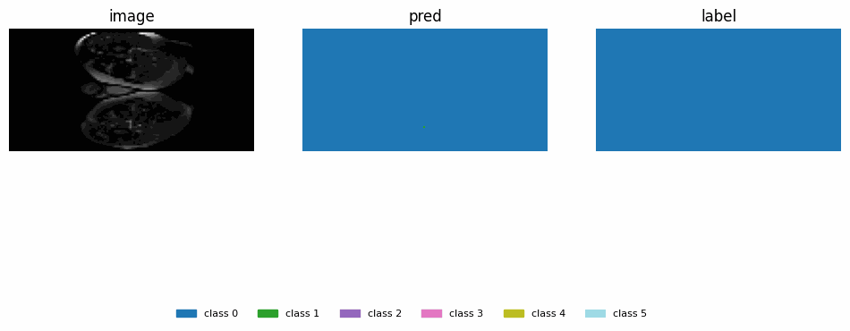

> Segment the (downsampled) Prostate 3D dataset with the 3D Improved UNet3D [1], ensuring all labels achieve a minimum Dice similarity coefficient of 0.7 on the test set. Use appropriate augmentation transforms in PyTorch. [Hard Difficulty – 3D Improved UNet]

See [base custom 3D U-Net](https://github.com/brose7561/PatternAnalysis-2025/tree/base-3D-UNet/recognition/3D-UNet-Prostate-47437870) for the original implementation.

# Overview

This repository trains and evaluates a CBAM3D Improved UNet3D for 3D prostate MRI semantic segmentation on downsampled NIfTI volumes.

### Aims:

The aim is to achieve ≥ 0.70 Dice similarity coefficient (DSC) for all foreground classes using an Improved UNet variant.

The secondary aim is to evaluate whether the improvements were necessary to achieve this goal.

### Method:

The project originally extends a PyTorch 2D U-Net into a 3D model. Dynamic ReLU (Dy-ReLU) activations and CBAM attention were added to create an Improved UNet variant. A batch-independent FRN TLU variant was briefly tested.

### Evaluation

Model performance was evaluated in two phases:

1. **Stress Test (Small-Scale)**

   * **Purpose:** Simulate low-compute and limited-data conditions
   * **Setup:** 7 training scans, 5 epochs
   * **Hardware:** Apple M1 CPU (no Metal acceleration)

2. **Final Training (Full-Scale)**

   * **Purpose:** Achieve the ≥ 0.70 Dice Similarity Coefficient (DSC) target
   * **Setup:** 169 training scans, 10 epochs
   * **Hardware:** NVIDIA A100 GPU

### Results:

The 3D UNet and the final Improved UNet met the aim of ≥ 0.70 DSC across all categories. The Improved UNet performed slightly worse in both evaluation phases. In particular, during the stress test, the Improved UNet showed much higher pixel scattering and lower DSC.

Aiming around 0.7–0.8 DSC, this investigation suggests a standard 3D UNet is recommended for this dataset.

### Extensions:

To better validate the Improved 3D UNet’s utility over the base 3D UNet, a new research motivation of “maximising DSC” is proposed. The aim is to investigate larger trends across longer training.

Stress testing the model under real-world constraints such as limited compute and small datasets became a key evaluation strategy in this project. However, the broader utility of these results remains unclear. An extension could explore stress testing as a model evaluation approach—for instance, using it to predict overall performance plateaus.

# Method

The baseline builds on the canonical 2D U-Net—contracting/expanding paths with skip connections—introduced by Ronneberger et al. ([U-Net, 2015](https://arxiv.org/abs/1505.04597)). I then ported the design to volumes in the spirit of 3D U-Net by replacing all 2D ops with their 3D counterparts ([Çiçek et al., 2016](https://arxiv.org/abs/1606.06650)). For training on class-imbalanced medical data, I combined cross-entropy with a soft-Dice term influenced by V-Net’s Dice loss ([Milletari et al., 2016](https://arxiv.org/abs/1606.04797)). Given tiny effective batch sizes in 3D, I used InstanceNorm3d instead of BatchNorm for more stable statistics ([Ulyanov et al., 2016](https://arxiv.org/abs/1607.08022)). ([arXiv][1])

---

## Original 3D U-Net

[https://github.com/brose7561/PatternAnalysis-2025/tree/base-3D-UNet](https://github.com/brose7561/PatternAnalysis-2025/tree/base-3D-UNet)

* **Architecture:** Four-level 3D encoder–decoder with skip connections for voxel-wise prostate segmentation.
* **Convolutions:** Two `3×3×3` convolutions per block for local spatial context.
* **Normalization:** `InstanceNorm3d` for batch-independent stability (batch size = 1).
* **Activation:** `LeakyReLU` throughout for smoother gradients and faster convergence.
* **Dropout:** Optional `Dropout3d` for light regularisation on small datasets.
* **Downsampling:** `MaxPool3d(2)` halves resolution each stage, doubling feature channels.
* **Bottleneck:** Expands final encoder channels ×2 to capture global 3D context.
* **Upsampling:** `ConvTranspose3d(2)` restores resolution; concatenated with encoder skip maps.
* **Skip alignment:** Auto pad/crop ensures exact size matching between encoder and decoder features.
* **Output:** Final `1×1×1 Conv3d` produces class logits for segmentation masks.
* **Initialization:** He (Kaiming) normal weight init tuned for LeakyReLU activations.
* **Input format:** NIfTI volumes (`.nii`/`.nii.gz`), normalised per-volume using z-score.
* **Resizing:** All data resampled to `128×128×64` — images with trilinear, labels with nearest-neighbour.
* **Augmentation:** Random 3D flips and random 90° rotations (label-preserving).
* **Loss:** Combined **Cross-Entropy + soft Dice**, ignoring background voxels (`ignore_index = 0`).
* **Metrics:** Per-class and mean Dice (excluding background).
* **Optimizer:** `AdamW(lr = 1e-3, weight_decay = 1e-4)` for stable weight decay handling.
* **Scheduler:** `ReduceLROnPlateau` halves LR when validation loss plateaus.
* **Precision:** Mixed precision (`torch.cuda.amp`) for faster, memory-efficient GPU training.
* **Batch size:** Default = 1; uses `pin_memory=True` for faster host→device transfer.
* **Epochs:** Default = 100; saves `best.pt` checkpoint when validation loss improves.
* **Validation:** Computes mean Dice per epoch on held-out validation set.
* **Testing:** Reloads best model and reports per-class Dice on test split.
* **Reproducibility:** Fixed random seeds, deterministic dataset split (80 / 10 / 10).
* **Logging:** Detailed logs in `/logs` and curves (`loss.png`, `dice.png`) saved in `/runs_3dunet`.

From this success, residual pre-activation blocks ([ResNet, 2015](https://arxiv.org/abs/1512.03385)) were added, static ReLU was replaced with Dynamic ReLU ([DyReLU, 2020](https://arxiv.org/abs/2003.10027)), and CBAM attention was injected on skip features (channel → spatial) ([CBAM, 2018](https://arxiv.org/abs/1807.06521)). Each improved stage uses `BatchNorm3d → DyReLU3d → Conv3d` ×2 with an identity shortcut; BN pairs well with residual learning, while InstanceNorm3d remains a drop-in fallback.

---

## Improved UNet3D

* **Base:** Builds directly on the original 3D U-Net architecture described above.
* **Blocks:** Replaced plain conv blocks with `BatchNorm3d → DyReLU3d → Conv3d` ×2 + identity skip.
* **Attention:** Added **CBAM3d** (Convolutional Block Attention Module).

---

## Dataset

This project used the ProstateX 3D MRI dataset from the [CSIRO Data Portal](https://data.csiro.au/collection/csiro:51392v2?redirected=true). The dataset contains labelled weekly MR volumes of the male pelvis, with each case including T2-weighted scans and corresponding segmentation masks.

### Data Splits & Reproducibility

* **Default splits:** `train/val/test = 80% / 10% / 10%` (standard).
* **Deterministic split** via `torch.Generator().manual_seed(args.seed)`.

---

## Repository Layout

```
modules.py     # DyReLU3d, CBAM3d, residual blocks, UNet3DImproved
dataset.py     # NIfTI dataset, pairing, resizing, augmentation, DataLoaders
train.py       # training loop, early stopping, LR scheduler, curve saving
predict.py     # single-volume inference, GIF triptych, NIfTI export, Dice
utils.py       # device utils, dice/loss, curve plotting
requirements.txt
pictures/      # figures and GIFs used in this README
```

---

# Figures & Training Snapshots

## Local Stress Tests

Stress testing was done on 7 3D pelvis scans for 5 epochs training locally (Mac M1 CPU only). Training took approximately 10 minutes.

> Originally, local stress tests were just for debugging. But since the standard 3D U-Net could hit a DSC above 0.7 with the full dataset, these small-scale tests actually show variations in architecture more than the fully trained versions.

### **Base 3D U-Net (Stress Test)**

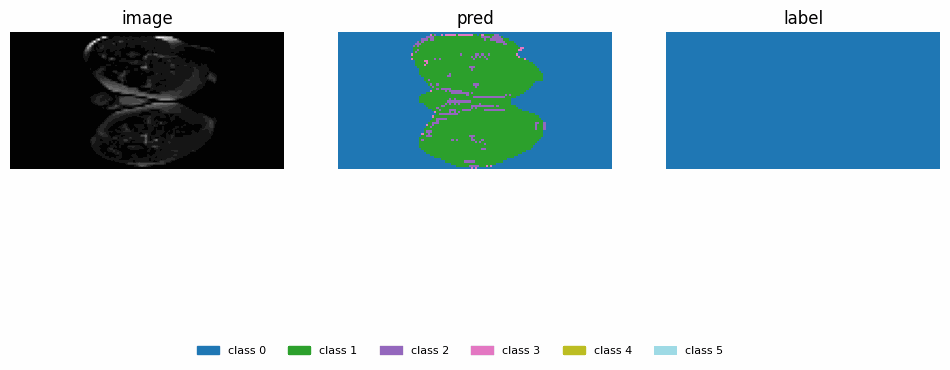
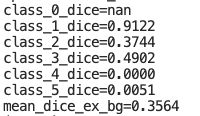

The base model excludes all improvements from the final architecture—no Dynamic ReLU (Dy-ReLU), no CBAM attention, no feature recalibration layers, and no stage-wise residual connections.

### **Improved UNet (Stress Test)**


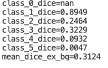

---

## Full Dataset Training for 10 Epochs

Training on the full dataset was done using UQ Rangpur compute with a scheduled job on a single A100 GPU. Training took about 10 minutes on this hardware.

**Base 3D U-Net (Final Test):**

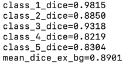

<p align="center">
  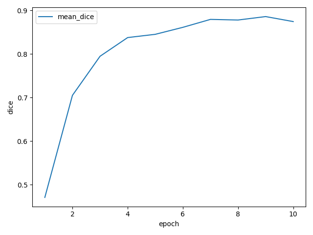
  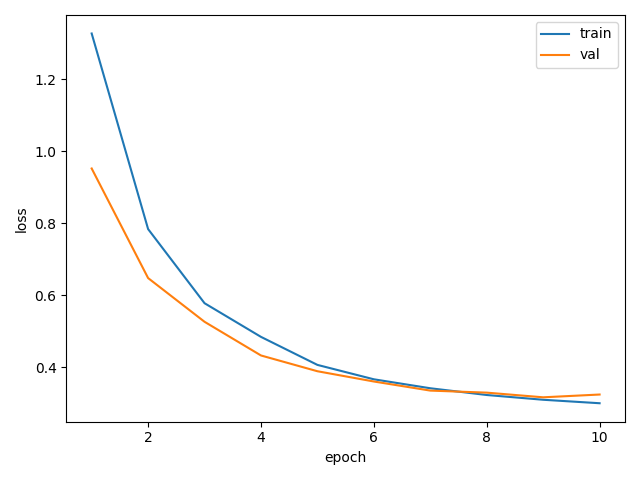
</p>

**Improved UNet (Final Test)**
 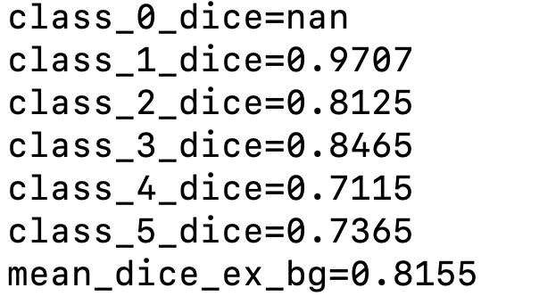

<p align="center">
  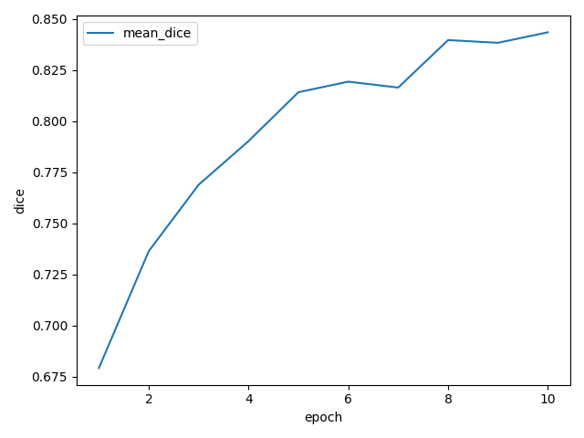
  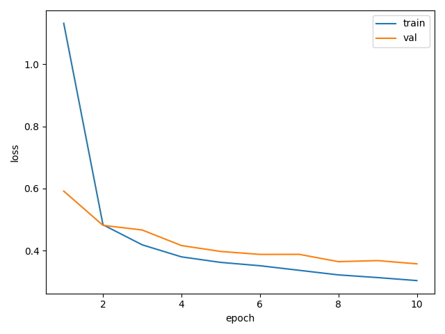
</p>

The average DSC dropped between the traditional and Improved UNet by 0.086 units. This result is not unexpected, as often the base 3D UNet reaches its peak quickly but plateaus, while the improved one learns slower but achieves a higher final Dice after more epochs. This is indicated by the shape of the curves above but would need a new investigation to validate.

In the context of achieving a DSC greater than 0.7, these results suggest the original 3D UNet is sufficient for this dataset.

---

## Usage

### 1) Clone and Install

```bash
# Python 3.10+ recommended
python -m venv .venv
source .venv/bin/activate # for mac
pip install -r requirements.txt
```

### 2) Data

Organize the downsampled **HipMRI / Prostate** data as:

```
/path/to/images/*.nii[.gz]
/path/to/labels/*.nii[.gz]
# Filenames must match by stem (e.g., case_00001.nii in both).
```

### 3) Train

```bash
python train.py \
  --image_dir /path/to/images \
  --label_dir /path/to/labels \
  --spatial_size <int int int> \
  --epochs <int> \
  --batch_size <int> \
  --lr 4e-4 \
  --num_workers <int> \
  --num_classes <int> \
  --ignore_index <int> \
  --outdir runs_improved_unet3d
```

#### Running UQ Rangpur matches default paths:

```bash
python train.py \
  --num_workers 1 \
  --epochs 10
```

#### During training, curves are saved to:

```
runs_improved_unet3d/loss.png
runs_improved_unet3d/dice.png
runs_improved_unet3d/best.pt
```

### 4) Inference (and Triptych GIF)

```bash
python predict.py \
  --image_path /path/to/test_volume.nii.gz \
  --label_path /path/to/test_label.nii.gz \   
  --checkpoint runs_improved_unet3d/best.pt \
  --num_classes <int> \
  --ignore_index <int> \
  --spatial_size <int> <int> <int> \
  --outdir pred_outputs \
  --gif_fps <int>
```

#### Example Inference:

```bash
python predict.py \
--image_path ./testdata/semantic_MRs/B006_Week0_LFOV.nii.gz \
--label_path ./testdata/semantic_labels_only/B006_Week0_SEMANTIC.nii.gz \
--checkpoint ./runs_localtest/best.pt
```

#### This writes:

```
pred_outputs/test_volume_triptych.gif   # image | prediction | label
pred_outputs/test_volume_pred.nii.gz    # predicted labelmap
```

---

## Pre-processing & Augmentation

* **Z-score normalization** per-volume
* **Resizing** to `spatial_size` (default **128×128×64**):

  * Images: **trilinear** interpolation
  * Labels: **nearest-neighbour** (to preserve integers)
* **Augmentations** (train only, lightweight & geometry-safe):

  * Random flips on each axis (p = 0.5)
  * Random 90° rotations on random axis pair (p ≈ 0.5)

> These augmentations are chosen to be label-preserving and memory-light. Implemented with PyTorch transforms.

---

## Training Choices & Rationale

* **Epochs:** **100** by default with early exit. The assignment targets **≥ 0.70 DSC**, so command line arg `--epochs 10` is sufficient.
* **Loss:** **CE + soft Dice** balances region coverage and boundary overlap.
* **Optimizer:** `Adam(lr=4e-4, weight_decay=1e-4)`; `ReduceLROnPlateau` for stability.
* **Early stopping:** Patience (default **25**) safeguards against overfitting and wasted epochs. In the end, I only trained 10 epochs to easily pass DSC 0.7.
* **Small-batch normalization:** If you see early “static”/scatter in predictions (common at batch=1), consider (see Appendix one):

  1. keep Dy-ReLU (already helps), and/or
  2. swap `BatchNorm3d` for **FRN+TLU** in the residual blocks for fully batch-independent normalization in extremely constrained memory regimes.

---

## References

* Ronneberger, O., Fischer, P., Brox, T. **U-Net: Convolutional Networks for Biomedical Image Segmentation.** MICCAI 2015. [arXiv:1505.04597](https://arxiv.org/abs/1505.04597)
* Çiçek, Ö., Abdulkadir, A., Lienkamp, S.S., Brox, T., Ronneberger, O. **3D U-Net: Learning Dense Volumetric Segmentation from Sparse Annotation.** MICCAI 2016. [arXiv:1606.06650](https://arxiv.org/abs/1606.06650)
* Milletari, F., Navab, N., Ahmadi, S.-A. **V-Net: Fully Convolutional Neural Networks for Volumetric Medical Image Segmentation.** 3DV 2016. [arXiv:1606.04797](https://arxiv.org/abs/1606.04797)
* Ulyanov, D., Vedaldi, A., Lempitsky, V. **Instance Normalization: The Missing Ingredient for Fast Stylization.** 2016. [arXiv:1607.08022](https://arxiv.org/abs/1607.08022)
* He, K., Zhang, X., Ren, S., Sun, J. **Deep Residual Learning for Image Recognition.** CVPR 2016. [arXiv:1512.03385](https://arxiv.org/abs/1512.03385)
* Chen, Y. *et al.* **Dynamic ReLU.** 2020. [arXiv:2003.10027](https://arxiv.org/abs/2003.10027)
* Woo, S., Park, J., Lee, J.-Y., Kweon, I.-S. **CBAM: Convolutional Block Attention Module.** ECCV 2018. [arXiv:1807.06521](https://arxiv.org/abs/1807.06521)
* Singh, S., Krishnan, S. **Filter Response Normalization Layer: Eliminating Batch Dependence in the Training of Deep Neural Networks.** CVPR 2020. [arXiv:1911.09737](https://arxiv.org/abs/1911.09737)
* **Improved U-Net3+ with Stage Residual for Brain Tumor Segmentation.** *Frontiers in Oncology*, 2022. [PMCID: PMC8793173](https://pmc.ncbi.nlm.nih.gov/articles/PMC8793173/)
* **CSIRO Data Portal – Prostate MRI Collection.** Dataset used in this project. [Link](https://data.csiro.au/collection/csiro:51392v2?redirected=true)

---

## Citation

If you build on this codebase in academic work, please cite the above methods and include a link to this repository in your acknowledgements.

---

## License

MIT

---

# Appendix

### **A1 – FRN TLU – Batch-Independent Norm (Stress Test):**

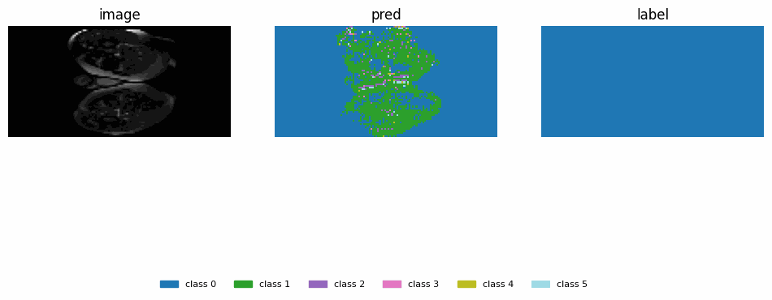

This is an intermittent model architecture tested but not continued. Similar to the final version, but batch-independent by replacing BatchNorm with FRN and TLU. The stress test on Improved UNet had a lot of static. [Improved U-Net3+ with Stage Residual for Brain Tumor Segmentation](https://pmc.ncbi.nlm.nih.gov/articles/PMC8793173/) discusses a similar issue arising from batch-size dependence. 