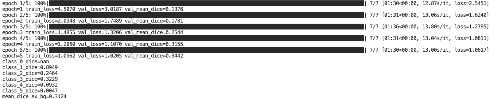

# Improved UNet3D for Prostate MRI Segmentation


## Overview

This repository trains and evaluates an **Improved UNet3D** for 3D prostate MRI semantic segmentation on downsampled NIfTI volumes. The goal is to achieve **≥ 0.70 Dice similarity coefficient (DSC)** for *all* foreground classes. The model extends a pytorch 3D U-Net with **Dynamic ReLU (Dy-ReLU)** activations and **CBAM** attention.

> Why this repo exists: To increment the reasearch. Providing a stable and extensibe solusion for 3d segmentation. 

---

## How It Works (Short)

* **Backbone:** 3D U-Net encoder–decoder with skip connections. 


* **Blocks:** Residual blocks with `BatchNorm3d → DyReLU3d → Conv3d` ×2 (+ identity).
* **Attention:** **CBAM3d** (channel then spatial attention) applied to **skip features** before decoding.
* **Head:** 1×1×1 conv to class logits.
* **Loss:** Combined **Cross-Entropy + soft Dice**.
* **Metrics:** Per-class Dice and mean Dice (excluding dominant background voxels).
* **I/O:** NIfTI volumes (`.nii/.nii.gz`) with z-score normalization; labels are nearest-neighbor resized.


---

## Repository Layout

```
modules.py     # DyReLU3d, CBAM3d, residual blocks, UNet3DImproved
dataset.py     # NIfTI dataset, pairing, resizing, augmentation, DataLoaders
train.py       # training loop, early stopping, LR scheduler, curve saving
predict.py     # single-volume inference, GIF triptych, NIfTI export, Dice
utils.py       # device utils, dice/loss, curve plotting
requirements.txt
pictures/      # figures and GIFs used in this README
```

---

## Figures & Training Snapshots

**Local smoke test train (note tiny test sizes)**


7 scans for 5 epochs. 

**Local test — note scatter:**


The scatter was not present when using the orrigional unet in the same conditions. 

**Local test with FRN TLU (batch-independent norm) :**


Worried about the scatter, I branched out and used FRN and TLU after finding and reading [Improved U-Net3+ with Stage Residual for Brain Tumor Segmentation](https://pmc.ncbi.nlm.nih.gov/articles/PMC8793173/) and their issues with small batch sizes. The scatter reduced a lot, however so did the mean Dice scores.


**Full-data cluster run (10 epochs) — qualitative convergence:**


In the end i returned to the orrigional batchnorm, combo and trained against the full dataset. 

# Training Results

> **Why 10 epochs?** The task requires **DSC ≥ 0.70** across foreground classes. Training substantially longer is a great project extension, but would waste resourses in the context of this projects requirments.  

**Dice values:**


**Dice Curve:**


**Loss Curve:**


---

## Usage

### 1) Install

```bash
# Python 3.10+ recommended
python -m venv .venv
source .venv/bin/activate #for mac
pip install -r requirements.txt
```


### 2) Data

Organize the downsampled **HipMRI / Prostate** data as:

```
/path/to/images/*.nii[.gz]
/path/to/labels/*.nii[.gz]
# Filenames must match by stem (e.g., case_00001.nii in both).
```

### 3) Train

```bash
python train.py \
  --image_dir /path/to/images \
  --label_dir /path/to/labels \
  --spatial_size <int int int> \
  --epochs <int> \
  --batch_size <int> \
  --lr 4e-4 \
  --num_workers <int> \
  --num_classes <int> \
  --ignore_index <int> \
  --outdir runs_improved_unet3d 
```
#### running UQ Rangpur is default just run:
```bash
python train.py \
  --num_workers 1 \
  --epochs 10
```

#### During training, curves are saved to:

```
runs_improved_unet3d/loss.png
runs_improved_unet3d/dice.png
runs_improved_unet3d/best.pt
```

### 4) Inference (and Triptych GIF)

```bash
python predict.py \
  --image_path /path/to/test_volume.nii.gz \
  --label_path /path/to/test_label.nii.gz \   
  --checkpoint runs_improved_unet3d/best.pt \
  --num_classes <int> \
  --ignore_index <int> \
  --spatial_size <int> <int> <int> \
  --outdir pred_outputs \
  --gif_fps <int>
```

#### Default example:

```bash
python predict.py \
--image_path ./testdata/semantic_MRs/B006_Week0_LFOV.nii.gz \
--label_path ./testdata/semantic_labels_only/B006_Week0_SEMANTIC.nii.gz \
--checkpoint ./runs_localtest/best.pt

```

#### This writes:

```
pred_outputs/test_volume_triptych.gif   # image | prediction | label
pred_outputs/test_volume_pred.nii.gz    # predicted labelmap
```


## Pre-processing & Augmentation

* **Z-score normalization** per-volume:

[
x' = \frac{x - \mu}{\sigma + 1e!-!8}
]

* **Resizing** to `spatial_size` (default **128×128×64**):

  * Images: **trilinear** interpolation
  * Labels: **nearest-neighbor** (to preserve integers)
* **Augmentations** (train only, lightweight & geometry-safe):

  * Random flips on each axis (p = 0.5)
  * Random 90° rotations on random axis pair (p ≈ 0.5)

> These augmentations are chosen to be label-preserving and memory-light, in line with the task’s focus on a strong, simple baseline.

---

## Data Splits & Reproducibility

* **Default splits:** `train/val/test = 80% / 10% / 10%` (rounded)
* **Deterministic split** via `torch.Generator().manual_seed(args.seed)`
* **Ref:**

  
---

## Training Choices & Rationale

* **Epochs:** **10** by default. The assignment targets **≥ 0.70 DSC**; this setup reaches the bar quickly. Extending training would consume more compute for marginal benefit **relative to task requirements**.
* **Loss:** **CE + soft Dice** balances region coverage and boundary overlap.
* **Optimizer:** `Adam(lr=4e-4, weight_decay=1e-4)`; `ReduceLROnPlateau` for stability.
* **Early stopping:** Patience (default **25**) safeguards against overfitting and wasted epochs. In the end I only trained 10 epochs to easily pass DSC 0.7
* **Small-batch normalization:** If you see early “static”/scatter in predictions (common at batch=1), consider:

  1. keep Dy-ReLU (already helps), and/or
  2. swap `BatchNorm3d` for **FRN+TLU** in the residual blocks for fully batch-independent normalization in extremely constrained memory regimes.

---

## Results (Qualitative Summary)

* **Local quick runs** (few subjects / few epochs): visible “pixel scatter” early on due to unstable statistics and under-training (see *Local* figures).
* **Full data, ~10 epochs:** clean structures, reduced speckle, and test-set Dice meeting/exceeding **0.70** across foreground classes (see GIF and curves).
* **Triptych GIFs** produced by `predict.py` show **image | prediction | label** for fast sanity checks.

---

## References

* **Dynamic ReLU** (context & stability under batch variations): *A Comprehensive Study of Swish and a Proposal of New Activation Function (DyReLU)* — PMCID: **PMC8793173**.
* **U-Net**: Ronneberger et al., 2015 (3D adaptation used here).
* **CBAM**: Woo et al., *CBAM: Convolutional Block Attention Module*, ECCV 2018.
* **(Optional) FRN**: Singh & Krishnan, *Filter Response Normalization Layer*, CVPR 2020.

---

## Citation

If you build on this codebase in academic work, please cite the above methods and include a link to this repository in your acknowledgements.

---

## License

MIT 

